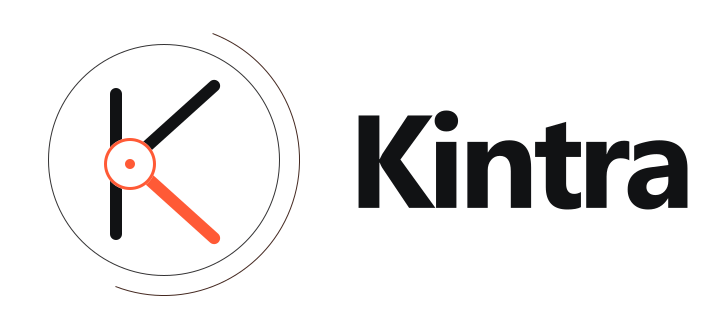

<div align="center">
  <picture>
    <source media="(prefers-color-scheme: dark)" srcset="rn-app/assets/images/kintra-logo-horizontal.svg">
    
  </picture>

  <h1>Your movement, understood.</h1>

  <p>A wearable platform for understanding how your joints move—and how that movement changes over time.</p>

  <p><strong>Wearable sensing · Personal references · Explainable feedback</strong></p>

  <p>
    <a href="#explore-kintra">Explore</a> ·
    <a href="#quick-start">Quick start</a> ·
    <a href="#the-research-pipeline">The algorithm</a> ·
    <a href="#project-status">Project status</a>
  </p>
</div>

---

Kintra brings movement monitoring down to the individual joint. Instead of a
single whole-body activity score, the platform is designed to help someone see
how a knee, ankle, elbow, or shoulder behaves during activity, compare similar
recordings against their own history, and inspect the measurements behind a change.

Built for the **2026 DTE Designathon**, this repository brings together the
companion apps, wearable design, and a Python research pipeline. The knee is the
first worked example; the wider product vision is a modular system for multiple joints.

> **Prototype status:** Kintra demonstrates software workflows and research
> methods. Hardware accuracy, real-athlete model performance, and injury-prevention
> outcomes have not been established. See [Project status](#project-status).

## Explore Kintra

| Experience | What you'll find | Project |
| --- | --- | --- |
| **Web companion** | Home, Trends, Joints, live movement inspection, recording reviews, and supporting evidence | [React + Vite website](web-app/README.md) |
| **Mobile companion** | Guided setup, joint summaries, movement comparisons, check-ins, and illustrated knee education | [Expo app handoff](rn-app/HANDOFF.md) |
| **Wearable presentation** | Interactive 3D sleeve model with orbit, knee-detail views, and fullscreen presentation | [Model viewer](modeling/viewer/README.md) |
| **Research pipeline** | Sensor preparation, movement features, activity context, personal references, and longitudinal comparisons | [Pipeline documentation](docs/modular-pipeline.md) |

### The companion experience

- **Home** leads with a movement observation and opens the evidence behind it.
- **Trends** compares the same joint and activity across a selected period.
- **Joints** keeps monitored joints and their recordings easy to explore.
- **Live** separates simulation from hardware inspection, with a
  **Record movement → Stop & review → Export** workflow for hardware recordings.

The apps share a dark palette, orange movement accents, blue comparison data,
and feedback cards that connect an observation to its supporting measurements.

## Quick start

Start each setup block from the repository root. Use **Node.js 22.18+** for the
website and its TypeScript software tests. The research pipeline additionally
needs Python and the dependencies in `requirements-pipeline.txt`.

### Web companion

```sh
cd web-app
npm ci
npm run dev
```

Open the localhost URL printed by Vite. The initial flow is
**Welcome → Knee guide → Home → Demo setup**. You can also open `/#live` directly.

For wearable connection details and the physical-device checklist, see the
[web README](web-app/README.md) and [website handoff](docs/web-app-handoff.md).
Device connectivity must match the firmware's transport and packet contract;
confirm the current integration before a hardware presentation.

### Mobile companion

```sh
cd rn-app
npm ci
npm start
```

Use the target offered by the Expo development server for your setup. Screen
behavior, native requirements, and current limitations are documented in the
[mobile handoff](rn-app/HANDOFF.md).

### 3D wearable viewer

```sh
cd modeling/viewer
npm ci
npm run dev
```

Open the printed URL, drag to orbit, and scroll or pinch to zoom. The viewer
includes full-body and knee-detail framing, camera presets, and fullscreen mode.
It is a separate app from the web companion; their dev-server ports may differ
when both are running.

### Python research demos

Create an isolated environment from the repository root:

```sh
python -m venv .venv-pipeline
```

<details>
<summary>Activate the environment on your operating system</summary>

**Windows / PowerShell**

```powershell
.\.venv-pipeline\Scripts\Activate.ps1
```

**macOS / Linux**

```sh
source .venv-pipeline/bin/activate
```

</details>

Install dependencies and run a synthetic engineering demo:

```sh
python -m pip install -r requirements-pipeline.txt
python scripts/run_kintra_pipeline_demo.py
```

For the bilateral configuration:

```sh
python scripts/run_bilateral_pipeline_demo.py
```

These demos write results under `data/baseline_demo/`. They do not establish
physical sensor accuracy or real-athlete performance. The separate
[hardware session adapter](scripts/HARDWARE_SESSION_ADAPTER.md) documents the
offline SD-CSV ingestion path and its calibration/readiness requirements.

## The research pipeline

The central question is **“How does this movement compare with this person's
own comparable movement?”** Kintra's research implementation combines:

1. **Sensor preparation:** signal checks, filtering, mounting calibration, and
   orientation estimation under the declared measurement assumptions.
2. **Movement features:** joint-motion and event measurements when the required
   sensor channels are available.
3. **Activity context:** movement classification, temporal modeling, and athlete
   confirmation so comparisons use the intended activity.
4. **Personal references:** comparisons with compatible prior recordings from
   the same person, side, movement, and measurement setup.
5. **Change over time:** waveform comparisons and longitudinal summaries, with
   explicit quality and reliability boundaries.

See the [modular pipeline](docs/modular-pipeline.md) for the stages and contracts,
the [pipeline review](docs/pipeline-review.md) for audit findings and validation
needs, and the [product context](PRODUCT_CONTEXT.md) for the reasoning behind the platform.

**The Python pipeline and browser live flow are currently separate.** The apps
display bundled synthetic observations and selected frozen Python results. The
website's live inspection uses the shared TypeScript bend detector; recording a
stream in the browser does not automatically run the full Python pipeline.

## Project status

| Area | Current boundary |
| --- | --- |
| **Home, Trends, and Joints** | Demonstration data is synthetic. The examples do not become a user's real personal baseline. |
| **Live hardware inspection** | Captured packets, debug-angle traces, candidate cycles, errors, and exports can be inspected. Device units, anatomical angles, and repetition detection still require physical validation. |
| **Scripted presentation feedback** | Four randomized examples are visibly labeled **Scripted demo feedback**. They are separate from calculated results and excluded from hardware exports and saved history. |
| **Python research pipeline** | Synthetic engineering demonstrations and a gated offline hardware adapter are available. Real-athlete model performance and measurement reliability remain to be established. |
| **Wearable and 3D design** | The current demo centers on a knee sleeve, an ESP32, and thigh/shank sensing. Models and mounting designs remain prototypes. |

Hardware readings retain their source and timestamps. Missing channels and
interrupted recordings remain visible rather than becoming fabricated
measurements. Hardware exercise interpretation stays gated pending validation.
Kintra does not currently provide validated injury-risk predictions or claims of
injury reduction.

## Repository map

| Path | Purpose |
| --- | --- |
| [`web-app/`](web-app/) | Standalone React/Vite companion website and transport software tests |
| [`rn-app/`](rn-app/) | Expo mobile app and dependency-free TypeScript demo/feedback contracts |
| [`scripts/`](scripts/) | Python processing, research demos, and offline hardware adapter |
| [`tests/`](tests/) | Python pipeline and algorithm regression tests |
| [`data/`](data/README.md) | Raw/processed fixtures, derived results, and documented data provenance |
| [`modeling/`](modeling/) | Blender wearable model, references, and browser presentation viewer |
| [`cad/`](cad/README.md) | Parametric OpenSCAD enclosure and mounting explorations |
| [`docs/`](docs/) | Architecture, measurement specifications, audits, and implementation handoffs |

The website imports pure TypeScript contracts and calculations from the mobile
project; it builds its DOM presentation separately. Python-generated snapshots
must be regenerated and rebuilt into an app to update its displayed results.

## Verification

From the repository root:

```sh
npm --prefix web-app test
npm --prefix web-app run build
npm --prefix modeling/viewer run build
```

With the Python environment activated and its dependencies installed:

```sh
python -m pytest -q
```

Browser transport tests use software mocks. Passing them verifies software
behavior—not Bluetooth/serial driver behavior, physical sensor accuracy, or
successful detection on a person. Complete the
[physical-device acceptance checklist](docs/web-app-handoff.md)
before presenting hardware results as verified measurements.

---

For product decisions, start with [PRODUCT_CONTEXT.md](PRODUCT_CONTEXT.md).
For implementation work, follow [AGENTS.md](AGENTS.md) and the relevant app handoff.
