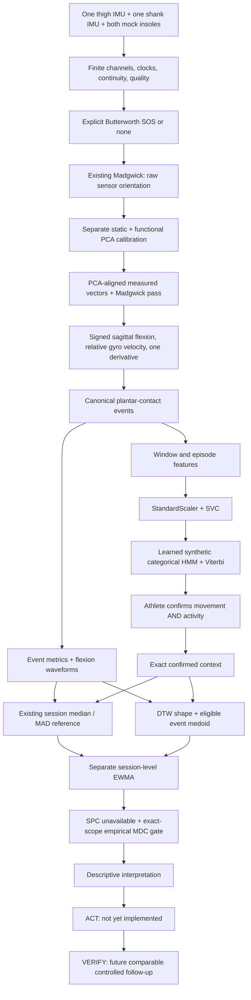

# Kintra modular research pipeline

This is a **synthetic software integration experiment** on `antonio`, additional
to the existing analyzers and UI demos. It does not validate hardware, classifier
performance on athletes, measurement reliability, baseline sufficiency, clinical
meaning, or injury prevention.

> Research supports the feasibility of the sensing and algorithmic methods.
> Kintra's current implementation demonstrates software integration using
> synthetic data. The final hardware and trained models require real-athlete
> and laboratory validation.

## Run

Use a separate Python environment to avoid mixing system binary dependencies:

```sh
python3 -m venv .venv-pipeline
source .venv-pipeline/bin/activate
python -m pip install -r requirements-pipeline.txt
python -m pytest -q
python scripts/run_kintra_pipeline_demo.py
```

The demo writes only `data/baseline_demo/modular_pipeline/demo.json` (inside the
existing ignored demo-output folder). It never rewrites mock inputs or app data.
The dependency versions are NumPy 2.2.6, SciPy 1.15.3, scikit-learn 1.7.2 and
pytest 8.4.2. No HMM/DTW or deep-learning framework is added. Original legacy
script paths still use their standard-library implementations.

## Bilateral product and single-knee designathon configurations

The full architecture now supports **four IMUs (left/right thigh and shank) +
bilateral calibrated insoles** through the same per-side processing worker.
The physical designathon demo requires **only two real IMUs on one knee sleeve
and ESP32**, with **two software-simulated insole streams and no physical insoles**.
The opposite knee is absent; it never receives fabricated angles or zeros.
The new bilateral fixtures validate software only: all four fixture IMUs and both
insole streams are `synthetic_demo`, including the one-knee demonstration case.
No physical acquisition or hardware validation occurred in this task.

```text
left thigh/shank  -> same per-side worker -> left knee / own-side history
right thigh/shank -> same per-side worker -> right knee / own-side history
left/right feet  -> independent contact/plantar metrics
valid knee results -> hard-gated bilateral knee comparison
valid foot results -> separate bilateral plantar comparison
```

`PipelineConfig.sensor_configuration` selects the explicit
`kintra-bilateral-session/2.0.0` contract. `SensorConfiguration` declares:

- `mode`: `bilateral_knees_plus_insoles` or `single_knee_plus_mock_insoles`;
- `knees.left/right.thigh/shank`: boolean `present`, `sensor_id`, `source`;
- `insoles.left/right`: boolean `present`, `sensor_id`, `source`;
- per-knee acquisition protocol for bilateral compatibility.

Sources are `hardware`, `synthetic_demo`, or `unavailable`. An absent sensor has
null identity and unavailable source. Present identities must be distinct.
Single-knee mode requires one complete pair and two synthetic insole streams.
Bilateral mode permits missing/failing channels and reports degradation explicitly.
Mixed measured/demo inputs expose every component source, plus
`contains_synthetic_measurements`; a global session flag never substitutes for
metric provenance. Conflicting synthetic-as-hardware declarations are rejected,
not relabeled into successful measurements. Source strings are an adapter
contract, not authentication or proof of physical origin.

Example physical-demo configuration (requires actual raw hardware input and
independently acquired calibration arrays):

```python
from sensor_configuration import Sensor, KneeSensors, SensorConfiguration
from kintra_pipeline import PipelineConfig, run_pipeline

sensors = SensorConfiguration(
    mode='single_knee_plus_mock_insoles',
    knees={
        'left': KneeSensors(),
        'right': KneeSensors(Sensor(True, 'hardware', 'esp32_thigh'),
                            Sensor(True, 'hardware', 'esp32_shank')),
    },
    insoles={side: Sensor(True, 'synthetic_demo', f'software_{side}_foot')
             for side in ('left', 'right')},
)
config = PipelineConfig(sensor_configuration=sensors, side='right',
    side_options={'right': {'calibration_records': right_calibration_records}})
result = run_pipeline(raw_session, config)
```

Raw `sources` IDs must match the configuration; per-packet declared sources must
also agree. Real adapters must retain original missing/invalid packets. Calling
`SensorConfiguration.synthetic(raw)` is a fixture convenience restricted to
explicitly synthetic sessions, not a hardware input adapter.

`side_options.left/right` overrides existing worker settings (calibration records,
filters, confirmed context, references, history, selected EWMA metric, reliability
evidence, acquisition context). Each knee independently validates, filters,
calibrates both pods and reconstructs signed flexion using the audited math.
Failure on one side leaves the other side usable. Feet are validated independently
and analyzed in their own complete contact windows, even with both knees missing.
Invalid feet block contact-dependent knee metrics, but retain valid knee motion.
No missing signals are interpolated or zero-filled.

Activity recognition uses `PipelineConfig.side` as the explicitly designated
motion source, retaining the original one-knee + two-feet feature vector and
SVM/HMM parameters. The other knee contributes biomechanics only. No feature
concatenation, retraining on bilateral fixtures, or implicit fallback to another
side occurs. If the designated knee fails, inference is unavailable; callers can
explicitly select the other valid side. Predictions never confirm activity.

App-ready outputs expose `configuration`, `input_quality`, `knees.left/right`,
`insoles.left/right`, `activity`, separate `bilateral.knee_kinematics` and
`bilateral.plantar_loading`, interpretation, and unchanged ACT/VERIFY placeholders.
Every knee stage retains explicit status/reasons. Scalar event metrics, waveform
references, scalar references/comparisons, EWMA, and interpretation retain source
provenance. The app is not wired to this contract in this task.

### Descriptive bilateral comparisons and hard gates

`bilateral_comparison.py` consumes computed metrics and existing event pairings;
it never reconstructs signals. Knee metrics: ROM, peak flexion, peak absolute
angular velocity/acceleration, and contact-to-peak-flexion time. Plantar metrics:
peak N, peak BW, contact-window impulse N*s, and observed contact-time difference.
Session comparisons use each side's median over the complete paired events.
Event comparisons are also retained; plantar windows belong to each foot.

Absolute asymmetry reuses `abs(L-R)/((L+R)/2)*100`. Signed difference and signed
percent use **right minus left**. Peak flexion and timing report differences,
not percentages. Zero denominator yields null percent, with descriptive values
and differences still available. Numerical asymmetry implies no clinical label.

Knee comparisons require both knee input streams, both thigh/shank calibrations
on both sides, compatible participant/joint and athlete-confirmed activity and
movement, identical processing configuration, compatible acquisition protocol,
sampling/context and sources, and complete paired events with finite valid
required metrics. Distinct anatomical sides and sensor IDs are expected; IDs
are not required to be equal. Missing/calibration/context/processing/event
failure sets the whole knee comparison to `unavailable`: **all numeric metric
fields are null and no numeric event comparisons are emitted**. Foot comparison
has its own validity/pairing gate and never depends on knee calibration.

Current left matches historical left; current right matches historical right.
Reference identity remains participant + joint + side + confirmed activity and
movement + sensor configuration/source signature + processing signature + metric.
DTW stays current-side waveform versus its own historical medoid; there is no
left-versus-right DTW asymmetry. EWMA has separate per-side histories/context and
never updates references. Default bilateral trend is knee ROM; foot metrics can
be selected explicitly through that side's `trend_metric` setting. Exact-context
MDC matching remains unchanged. No empirical bilateral reliability is supplied;
raw differences are available but measurement-error and clinical claims remain
null/unestablished.

### Bilateral software demo

```sh
python scripts/run_kintra_pipeline_demo.py       # unchanged legacy caller
python scripts/run_bilateral_pipeline_demo.py
python -m pytest -q
```

The new demo writes only the ignored
`data/baseline_demo/bilateral_pipeline/demo.json`. It demonstrates symmetric
motion/loading; reduced right ROM with unchanged left motion and separate
own-side references; increased right force with unchanged knee signals; failed
left calibration; missing right knee; incompatible processing; and the actual
demo's **missing-left / valid-right / bilateral mock-feet** availability pattern.
Its five reference sessions are deterministic engineering fixtures with
provisional reference status, not validated longitudinal acquisitions. Fixed
references, descriptive differences and null empirical MDC are explicit.

## Architecture and legacy primary configuration



`run_pipeline(raw_session, PipelineConfig(...))` is the high-level entry point.
Its primary `imu_pair_plus_insole` profile reads only the selected knee's two
IMUs and both calibrated insole streams. It does not invent the opposite knee.
Extra bilateral IMUs in legacy fixtures are ignored by this configuration.
`imu_pair_only` retains motion reconstruction and SVM inference, but contact
events/loading/waveform references are unavailable without insoles; it does not
invent force or landing timing from acceleration.

The raw Madgwick pass is retained as provenance. After independent calibration,
a second pass fuses the **rotated measured vectors**. This explicitly avoids
treating unobservable 6-DOF sensor yaw as an anatomical heading. Common zero
segment yaw, initial stationary tilt, upright calibration and sagittal motion
remain assumptions. This is not general 3-D anatomical joint decomposition.

## Stage contract

Every stage exposes `status`, `version`, `provenance`, and `reasons`. Meaningful
states include `ready`, `invalid_input`, `unavailable`, `calibration_required`,
`requires_confirmation`, `insufficient_reference`, and
`reliability_not_established`. ACT/VERIFY explicitly say `not_yet_implemented`.
Unexecuted dependent stages have an upstream-unavailable reason rather than
fabricated output. Input objects and fixed references remain unchanged.

The result records input quality, filtering, orientation, calibration,
kinematics, events, activity features, SVM, temporal model, confirmation,
biomechanics, scalar reference, waveform reference/comparison, longitudinal
trend, SPC, reliability, interpretation, ACT and VERIFY separately. There is no
single health/risk score. Raw fixture truth, phase labels and annotations do not
enter the production calculations or returned sensor results.

## Algorithms, evidence, validation and claims

### Signal quality and Butterworth SOS

- **Problem:** reject missing/corrupt channels and optionally attenuate specified
  frequency content without bridging gaps.
- **Inputs:** finite timestamped gyro/accelerometer vectors, selected sensor
  profile, quality flags, sampling rate, explicit `FilterConfig`.
- **Outputs:** a copy with filtered IMU channels; configuration and quality
  reasons. Invalid input remains missing in the original and dependent analysis
  is unavailable. Legacy ideal packets without flags retain an explicit assumed
  valid contract; explicit invalid flags always reject processing.
  Missing sensor identities, required pressure cells/geometry, valid-contact
  pressure descriptors, or BW normalization mass fail explicitly. Undeclared
  legacy IMU quality flags are counted and labeled as an assumption.
- **Precedent:** SciPy's [Butterworth SOS design](https://docs.scipy.org/doc/scipy/reference/generated/scipy.signal.butter.html)
  and [forward/backward SOS implementation](https://docs.scipy.org/doc/scipy/reference/generated/scipy.signal.sosfiltfilt.html).
- **Current validation:** unchanged ideal samples, finite filtered signals,
  rejected dropout/gaps, bad configuration, Nyquist and short-padding tests.
- **Limits:** no validated physical cutoff, synchronization correction,
  resampling or dropout recovery. Filtering changes measured peaks and must
  match the reference processing context.
- **Allowed claim:** configuration and numerical processing were recorded.
- **Not allowed:** noise removal or accuracy validated for Kintra hardware.

Default `enabled=False`, order 4 (unused), `cutoff_hz=None`,
`mode=offline_zero_phase`, `signal_type=imu`,
`provenance=ideal_synthetic_filter_none`. Enabled offline filtering uses
`sosfiltfilt` with SciPy's default padding and is **non-causal/post-session**.
Short signals fail rather than silently changing padding. The separate `causal`
path uses `sosfilt` initialized from the first measured sample; it has phase
delay and is a batch demonstration, not a streaming state API. The test-only
8 Hz/order-4 choice is `engineering_demo_parameter`, never a universal cutoff.
Insoles are passed through without pressure/force filtering or recalibration.

### Madgwick and aligned kinematics

- **Problem:** fuse gyro and gravity-related accelerometer information into
  orientation, then derive one instrumented knee's sagittal motion.
- **Inputs:** rad/s gyro, internally normalized accelerometer, actual dt;
  calibrated sensor-to-segment transforms for anatomical reconstruction.
- **Outputs:** Hamilton `(w,x,y,z)` sensor/segment-to-world orientations;
  relative `conjugate(thigh) * shank`, signed +Y pitch, aligned shank gyro Y
  minus thigh gyro Y, one central/one-sided finite difference for acceleration.
- **Precedent:** [Madgwick's original resources](https://x-io.co.uk/open-source-imu-and-ahrs-algorithms/).
  Existing filter equations and derivative arithmetic are reused unchanged.
- **Current validation:** ideal signed motion, unit finite quaternions, mounting
  regressions, preserved legacy velocity/acceleration tests.
- **Limits:** initial stationary tilt and common zero yaw, sagittal restriction,
  Euler pitch in +/-90 degrees, no magnetometer, translation/bias/skin artifacts
  not validated. Gyro Y subtraction is not a general 3-D joint model.
- **Allowed claim:** synthetic software reconstruction under declared assumptions.
- **Not allowed:** real-world anatomical angle accuracy, internal joint force,
  shear, joint moment, tissue strain, fatigue or injury risk.

X is forward, Y is left, Z is up. Static accelerometer specific force is +Z;
physical gravity is -Z. Positive flexion is +Y. `beta=0.1` and 200 stationary
initialization iterations are the existing ideal-fixture choices. The estimated
angle is never made positive by taking its absolute value.

### Static + functional PCA calibration

- **Problem:** remove a fixed sensor mounting rotation from segment coordinates.
- **Inputs:** independent upright-static accelerometer samples and a designated
  positive-flexion gyro sweep for **each** thigh/shank sensor.
- **Outputs:** separate proper orthonormal `R_sensor_to_segment` matrices, sample
  counts, singular values, axis-sign/pose assumptions and calibration version.
- **Precedent:** established SVD via [NumPy](https://numpy.org/doc/stable/reference/generated/numpy.linalg.svd.html);
  functional IMU calibration has research precedent in
  [Favre et al. (2009)](https://pubmed.ncbi.nlm.nih.gov/19665712/).
  Kintra's restricted static/PCA construction is not claimed to reproduce that
  paper's full 3-D protocol or accuracy.
- **Current validation:** identity, thigh-only, shank-only and independent dual
  rotations recover the same underlying synthetic motion; matrices satisfy
  orthogonality/determinant +1; label-poisoning and degeneracy tests.
- **Limits:** upright static posture is required; PCA axis sign requires a
  directed positive sweep. Insufficient excitation, ambiguous principal axes,
  gravity/rotation-axis degeneracy and unresolvable sign fail closed. No thigh
  axis is estimated from a fixed thigh in the recording; it needs its own
  separate functional calibration acquisition.
- **Allowed claim:** synthetic fixed-mount effects can be corrected in software.
- **Not allowed:** validated mounting repeatability/anatomical calibration accuracy.

The gyro matrix is centered and decomposed by SVD. Its dominant right singular
vector supplies the rotation axis; the positive-sweep mean resolves sign.
Static mean specific force supplies +Z; cross products construct/re-orthogonalize
X/Y, and determinant +1 is checked. No mounting-angle label enters calibration.

### Canonical biomechanical events and metrics

- **Problem:** share actual signal-derived onset/offset definitions between
  activity recognition and event-based biomechanics.
- **Inputs:** continuous processed knee motion and bilateral plantar normal
  force, explicit `EventProtocol` and available pressure-cell geometry.
- **Outputs:** complete contact onset/offset intervals, nearest one-to-one
  bilateral pairing, between-contact noncontact intervals, monitored-side
  contact/landing candidates, peak flexion within onset-to-offset bounds.
- **Precedent:** reuse the repository's existing threshold/contact definitions
  and audited ROM, pressure-times-area force, BW normalization and trapezoidal
  integration. **TODO:** establish and source an appropriate task/hardware event
  protocol with laboratory force reference; 20 N is not universal physiology.
- **Current validation:** both branches share the same event version;
  annotations/labels do not affect events; quality, gaps and inconsistent
  pressure-force data make events unavailable; truncated contacts are excluded.
- **Limits:** no force-plate flight validation, hysteresis, mixed-task event
  protocols or interrupted-recording recovery. A contact is a landing candidate
  until the movement is confirmed.
- **Allowed claim:** complete synthetic contacts using the declared threshold.
- **Not allowed:** validated flight time, ground-reaction equivalence for real
  insoles, clinical landing quality or unsafe contact.

`contact_threshold_n=20`, source `existing_Kintra_synthetic_demo_20_N_rule`,
task `synthetic_contact_and_landing_candidate`, hardware validation false;
bilateral pairing tolerance 0.1 s. Above-threshold is strictly `force > threshold`.
No crossing interpolation. Peak-flexion search includes the observed offset.

New reports explicitly use **canonical contact windows**. They reuse
`summarize_side` owned by `event_biomechanics.py` for angle/peak/ROM/velocity/acceleration,
plantar force, BW, trapezoidal impulse and pressure/COP arithmetic. Complete
canonical contacts supply their observed onset-to-offset contact time and average
`(peak_force - onset_force)/(peak_time - onset_time)` loading rate. This is average
dF/dt, not force jerk. Pressure means retain the existing 20 N valid-contact
definition. The opposite knee remains unavailable. The legacy annotated-window
analyzer is unchanged, and its impulse results are not silently replaced:
`contact_window_impulse_bw_s` has its own metric name and processing scope.
External plantar normal force is never labeled internal knee compressive force.

### Window features + SVM

- **Problem:** propose broad movement classes from measured motion and support.
- **Inputs:** one instrumented knee/segment gyro signals; bilateral force in the
  primary profile; same extractor for full episodes and every window.
- **Outputs:** raw SVM candidate, named features and `model_decision_scores`;
  never sport, probabilities, confidence percentages or confirmation.
- **Precedent:** [scikit-learn SVC](https://scikit-learn.org/stable/modules/generated/sklearn.svm.SVC.html)
  and StandardScaler; no hand-written SVM. **TODO:** verify population/setup
  appropriate athlete-recognition research before claiming relevance/performance
  for these feature/sensor choices.
- **Current validation:** five synthetic classes, primary/fallback profiles,
  held-out synthetic session groups, metadata poisoning and invalid-signal tests.
- **Limits:** highly idealized manufactured class separability, small training
  corpus, no real-athlete generalization or sport recognition; out-of-domain
  rejection is not a validated model capability.
- **Allowed claim:** a synthetic model candidate to confirm or correct.
- **Not allowed:** classifier accuracy on real people or identification of sport.

The model is `StandardScaler + SVC(kernel=rbf, C=10, gamma=scale,
probability=False, decision_function_shape=ovr)`. Forty training sessions
(eight variants x five classes) and ten held-out sessions (variants 8/9) have
disjoint IDs; all frames/windows from a session belong to that group. The scaler
is trained only on training inputs. Classes are `low_activity`, `walking_like`,
`running_like`, `squat_like_repetitions`, `repeated_jump_landing`.

Motion features: knee ROM, mean flexion, velocity RMS, absolute peak velocity,
velocity SD, dominant demeaned velocity FFT frequency, thigh/shank gyro RMS.
Each foot contributes mean force/BW, peak force/BW, supported fraction, complete
contacts/s and mean complete contact time; paired contacts/s completes the
19-feature primary vector. The fallback has eight motion features. Zero complete
contacts is a valid absence descriptor; invalid/missing signals cannot become
zero features. FFT frequency is a descriptor, not a measured physiological label.

`WindowConfig(duration_s=6, overlap_fraction=0.5,
feature_schema_version=one-knee-motion-bilateral-feet/1.0.0)` is an engineering
model choice. At 100 Hz it uses 600 samples, advancing 300. Trailing short windows
are excluded with their sample count recorded; no padding or interpolation.
The full-record episode prediction remains separate.

### Categorical HMM + Viterbi

- **Problem:** model continuity across sequential noisy movement observations.
- **Inputs:** raw window SVM labels, learned categorical transitions/emissions
  and initial state probabilities over the same five broad movement classes.
- **Outputs:** separate temporal candidate for each window plus complete model
  matrices/provenance. Earlier SVM outputs remain unchanged.
- **Precedent:** standard HMM/Viterbi mathematics, as explained in
  [Jurafsky and Martin's HMM appendix](https://web.stanford.edu/~jurafsky/slp3/A.pdf).
  This transparent NumPy implementation uses no new HMM dependency.
- **Current validation:** deterministic log-space dynamic programming agrees
  with exhaustive sequence likelihood on a small fixture; normalized positive
  matrices, raw-output preservation, unknown observations and group leakage tests.
- **Limits:** transitions describe engineered synthetic bouts, not athlete
  transition probabilities. Overlapping observations are dependent; this simple
  categorical model does not model that dependence or validate bout boundaries.
- **Allowed claim:** a temporal model suggestion to confirm or correct.
- **Not allowed:** temporal output establishes movement/activity truth.

Transition/initial counts come from eight labeled synthetic training sequences.
Their start states rotate across all classes so a clipped recording is not
assumed to begin in low activity. Emissions come from group cross-validated
training SVM confusion (`GroupKFold(n_splits=5)`, fold-local scalers); held-out
test sessions are not used. Laplace pseudocount is 1. Matrices are normalized
and stored. The engineered base bout order is low x2, walking x4, running x4,
low x1, jump/landing x4, squat x4, rotated to vary starts. None of these counts
establish real transition probabilities. Viterbi computes log-likelihood
recurrences/backpointers; it is not a majority vote.

### Athlete confirmation and scalar personal reference

- **Problem:** compare equivalent measurements under athlete-authoritative
  movement and real-world activity contexts.
- **Inputs:** separately recorded model history, explicit movement/activity
  selections and provenance, quality-eligible event metrics across sessions.
- **Outputs:** frozen session-median / between-session MAD distributions and
  signed deviations, plus confirmation history and context mismatches.
- **Precedent:** existing Kintra median/MAD learner and monitoring/reliability
  principles in [Bourdon et al. (2017)](https://pubmed.ncbi.nlm.nih.gov/28463642/)
  and [Hopkins (2000)](https://pubmed.ncbi.nlm.nih.gov/10907753/).
- **Current validation:** missing either confirmation blocks fitting/comparison;
  Basketball+Jump differs from Basketball+Running and Volleyball+Jump;
  correction leaves signals/metrics/model history unchanged; legacy tests pass.
- **Limits:** local JSON provenance is not authenticated user identity;
  sufficient real repeated acquisitions and cautious future updating are needed.
  The legacy UI/demo remains its separately labeled activity-only task prototype,
  rather than pretending it has adopted this new two-part contract.
- **Allowed claim:** provisional descriptive comparison under confirmed context.
- **Not allowed:** five trials or invented dates establish a validated longitudinal
  personal baseline; MAD is SEM or MDC; a difference is clinically meaningful.

Exact canonical key: participant + knee joint + monitored knee side +
confirmed activity + confirmed movement + sensor profile/source IDs, sampling
and geometry/acquisition signature + processing version/signature. Metric-side
(including foot side for loading) and metric also participate. The processing
signature includes filter, Madgwick/derivative settings, calibration protocol
and event protocol. Per-record calibration matrices remain provenance; different
valid mounting corrections do not become different biological activities.
Configuration labels alone cannot override signature incompatibility.

Sources are `user_confirmed`, `user_corrected` or explicit `manually_selected`.
Scripted demo selections are declared assumptions, not real athlete actions.
Model labels alone never grant either confirmation. The existing scalar learner
is reused via an adapter, not replaced. Its minimum three events/five sessions
remain configurable software sufficiency choices and status stays
`provisional_reference`, never scientifically validated by counts. The older
20-event experiment still uses events 1–5 as `controlled_test_reference` and
holds them fixed against events 6–20. No adaptive updating is introduced.

### DTW waveform comparison and event medoid

- **Problem:** describe event waveform shape separately from scalar magnitude.
- **Inputs:** finite knee-flexion samples during canonical contact and confirmed,
  compatible quality-eligible reference events from multiple sessions.
- **Outputs:** named waveform/method/normalization/sample counts, DTW distance,
  session median distance, and a representative actual eligible reference event.
- **Precedent:** standard DTW dynamic programming described by
  [Müller's author-maintained FMP tutorial](https://www.audiolabs-erlangen.de/resources/MIR/FMP/C3/C3S2_DTWbasic.html).
  Event medoid is the minimum-total-distance representative; no invented average
  waveform or new distance algorithm is used.
- **Current validation:** identical zero distance, amplitude invariance,
  time-stretched similarity, clearly different deterministic shape, finite-data
  rejection, medoid eligibility, context gating and frozen scalar references.
- **Limits:** unrestricted warping, small synthetic corpus, no empirical
  similarity limits, O(NM) distance and quadratic pairwise event cost. Constant
  signals have no defined z-normalized shape and are unavailable. Event medoid
  contributions are per event; unequal event counts could weight sessions unevenly.
- **Allowed claim:** descriptive shape distance with magnitude metrics separately.
- **Not allowed:** safe/unsafe, normal/abnormal, risk thresholds or combined score.

Current waveform is knee flexion only; force waveform DTW is deferred. Each
event is z-normalized with population SD; there is no resampling, interpolation
or absolute-value sign correction. Endpoint-constrained DTW uses squared local
cost and diagonal/right/down moves. Reported distance is RMS local cost along
the minimum-total-cost path (not optimization of normalized path cost).
Ties are deterministic. The reference medoid minimizes total pairwise reported
distances among eligible events; it is stored separately from scalar references.

### EWMA and conservative SPC

- **Problem:** distinguish session-to-session trend analytics from a single
  observation and from baseline updating.
- **Inputs:** ordered unique confirmed sessions, one selected metric, exact
  context, explicit lambda and source.
- **Outputs:** session points, EWMA, first-to-last direction, recorded factor;
  `spc_status=reference_limits_not_established`, no alarm.
- **Precedent:** [NIST EWMA guidance](https://www.itl.nist.gov/div898/handbook/pmc/section3/pmc324.htm).
  Only its smoothing recurrence is implemented; industrial control limits are
  not transplanted to an athlete.
- **Current validation:** exact known sequence, invalid factors, incompatible
  contexts, null observations, sustained programmed force increases, frozen baseline.
- **Limits:** lambda 0.3 is `engineering_demo_smoothing_factor`, not physiological;
  no validated trend/alert threshold or adequate real reliability history.
- **Allowed claim:** recorded comparable-session smoother increased/decreased.
- **Not allowed:** fatigue, adaptation, injury, or an out-of-control athlete alarm.

Initialize at the first valid session value. Missing/incompatible points have
null EWMA and do not update state; later eligible sessions resume from the last
valid state, explicitly recorded. The selectable metrics are knee ROM, per-foot
peak force/BW, contact-window impulse/BW*s and knee-flexion DTW distance.
The demo selects right peak plantar force/BW only. No reference is rewritten.

### Reliability/MDC, interpretation, ACT and VERIFY

- **Problem:** prevent descriptive differences being mistaken for changes beyond
  measurement error or clinical findings.
- **Inputs:** scalar deviations, waveform/trend descriptors, quality, confirmed
  context; independently supplied empirical metric/unit/task/side/configuration/
  processing-specific reliability evidence if it exists.
- **Outputs:** null MDC/conclusion with `reliability_not_established` unless exact
  empirical evidence matches; then only descriptive `abs(change) > MDC`.
  Interpretation exposes supporting measurements. ACT and VERIFY remain
  explicit placeholders.
- **Precedent:** repository monitoring/reliability sources above; human
  confirmation and conservative interpretation are product design safeguards,
  not new validated scientific algorithms.
- **Current validation:** null evidence and synthetic MAD never enable MDC;
  mismatched units/task/side/configuration/processing reject evidence; injected
  test-only evidence exercises both branches without populating a Kintra threshold.
- **Limits:** no empirical Kintra typical error, CV, SEM or MDC. Tests inject an
  evidence-contract stub, not a sourced real Kintra study. Follow-up/action
  protocols, authentication and real ingestion are future work.
- **Allowed claim:** difference and unavailability of a measurement-error conclusion.
- **Not allowed:** clinical significance, unsafe movement, injury probability,
  treatment, or fabricated reliability values.

Interpretation includes confirmed context, scalar differences, waveform DTW,
longitudinal trend, reliability and signal/calibration quality. VERIFY's future
matching contract retains activity, movement, participant/joint/side,
configuration, processing and exact reliability rules, with an explicitly chosen
follow-up strategy; it must not force a legitimate new strategy back to history.

## Numerical parameters and further validation

All model/window/filter/event/EWMA parameters are engineering choices requiring
task-, sensor- and athlete-specific physical validation before product claims.
No cutoffs, classifier scores, DTW distances or variability limits are clinical
thresholds. Numerical guards are implementation safeguards, not physiology:
timestamps 1e-8 s; PCA axis norm 1e-10, excitation/sign 1e-8 and dominant/second
singular-value ratio >2; rotation checks 1e-8/1e-10; DTW SD >1e-12; FFT nonzero
amplitude 1e-10. Existing pressure-force tolerances remain 1e-12 relative and
1e-10 N absolute. Regression angle tolerances (<0.5 degrees for the cosine test,
<1 degree for the landing demo) are software checks only.

Synthetic training uses 100 Hz, six-second records, variant scale
`1+0.02*(variant-4)` and period factor `1+0.015*(variant-4)`. Nominal periods are
5/1/0.65/1.8/2 seconds for low/walk/run/squat/jump. Non-jump cosine half-excursion
amplitudes are 0.002/0.22/0.35/0.6 rad. Walking/running contacts last 0.65/0.3 of
their periods, alternate by half a period and begin at 0.8 s; jump contacts use
0.6 s and the existing Gaussian knee pulse; squat uses sustained mock support
at 0.3 times the existing force pulse peak. These manufacture test classes, not
real physiological distributions or validated recognition performance.

The demo has five six-event synthetic reference sessions; a held-out balanced
mock recording replayed twice gives six contacts and three overlapping windows.
Separate shifts scale force and its pressure cells together by
1/1.05/1.10/1.15/1.20. Mounting fixtures use identity, thigh Euler XYZ (0,15,0),
shank (25,10,-20), and independent (15,-10,12)/(-25,15,-30) degrees.
Separate calibration records have 30 static samples and 60 directed gyro samples
spanning 0.1–1 rad/s. These values are disclosed synthetic construction choices.

Future validation must establish synchronized real sensor acquisition, actual
mounting/calibration reliability, appropriate filtering/event protocols,
annotated athlete/session-separated movement data, representative repeated
reference history, waveform/trend interpretation and exact-scope reliability.
The existing UI is preserved; it does not yet ingest this modular pipeline or
persist authenticated movement confirmations.
